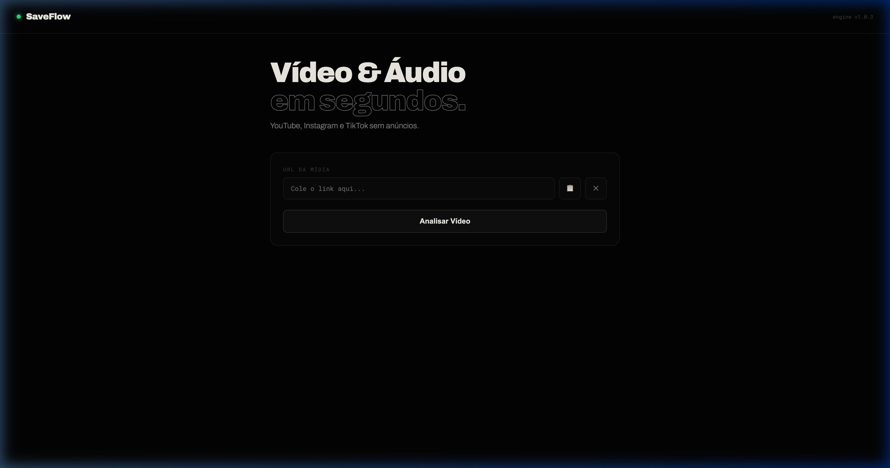

# 🌊 SaveFlow — Download Direto

SaveFlow é uma ferramenta minimalista e poderosa para baixar vídeos e áudios do **YouTube, Instagram e TikTok** sem anúncios e com foco em privacidade.



## ✨ Funcionalidades
- **TikTok sem Marcas d'Água:** Suporte completo para links do TikTok com bypass de bloqueios recentes.
- **YouTube & Instagram:** Download nos melhores formatos disponíveis (MP4 e MP3).
- **Sem Anúncios:** Interface limpa e direta.
- **Privacidade total:** O processamento acontece no servidor, sem redirecionamentos externos.
- **Compatível com Chrome:** Downloads registrados no histórico oficial do navegador.

## 🐳 Como rodar com Docker (Windows / Linux / Mac)
**Este é o método mais fácil.** Você não precisa instalar Python nem FFmpeg manualmente.

1. Instale o [Docker Desktop](https://www.docker.com/products/docker-desktop/).
2. Na pasta do projeto, rode:
   ```bash
   docker-compose up --build
   ```
3. Acesse: `http://localhost:5001`

---

## 🚀 Instalação Manual (Alternativa)

### 🪟 Windows
1. Instale o [Python 3.12](https://www.python.org/downloads/windows/).
2. Baixe o [FFmpeg](https://ffmpeg.org/download.html) e adicione-o ao seu PATH do sistema (ou use o Chocolatey: `choco install ffmpeg`).
3. Abra o terminal e rode:
   ```powershell
   python -m venv venv
   .\venv\Scripts\activate
   pip install flask yt-dlp curl_cffi flask-cors
   python server.py
   ```

### 🐧 Linux (Ubuntu/Debian)
1. Instale as dependências do sistema:
   ```bash
   sudo apt update
   sudo apt install python3.12 python3.12-venv ffmpeg -y
   ```
2. Prepare o ambiente:
   ```bash
   python3 -m venv venv
   source venv/bin/activate
   pip install flask yt-dlp curl_cffi flask-cors
   python server.py
   ```

### 🍎 MacOS
1. Recomendamos usar o [Homebrew](https://brew.sh/):
   ```bash
   brew install python@3.12 ffmpeg
   ```
2. Prepare o ambiente:
   ```bash
   python3.12 -m venv venv
   source venv/bin/activate
   pip install flask yt-dlp curl_cffi flask-cors
   python server.py
   ```

## ☁️ Deploy na Nuvem
O projeto já inclui um **Dockerfile** configurado. Basta conectar este repositório ao **Railway.app** ou **Render.com**. O sistema cuidará da instalação do Python e do FFmpeg automaticamente.

---
*Desenvolvido para uso pessoal e simplificação de acesso a mídias.*

© 2026 eldolucio. Todos os direitos reservados.
